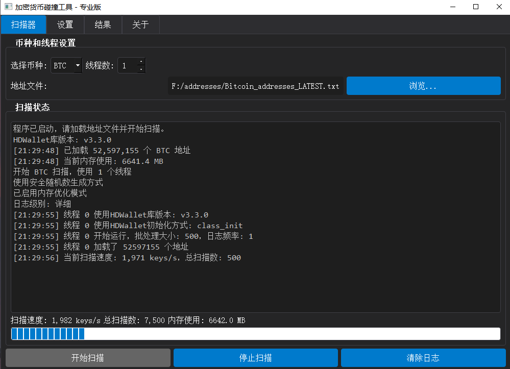

# 🔥 加密货币私钥碰撞工具 - 专业版 🔥

## 💥 什么是私钥碰撞？

私钥碰撞是一种数学上的"暴力破解"方法，通过随机生成私钥并检查对应的公钥地址是否与目标地址匹配。**这就像在宇宙中所有沙粒里找一粒特定的沙子，几乎不可能成功，但技术上可行.也有身边的朋友成功过,所以一切都是天意。**

本工具支持多种主流加密货币：
- 比特币 (BTC)
- 以太坊 (ETH)
- 波场 (TRX)
- 狗狗币 (DOGE)
- 莱特币 (LTC)
- 索拉纳 (SOL)

## 🚀 极致优化技术

我们在碰撞算法上做了极致优化：

1. **多线程并行处理** - 充分利用多核CPU，每秒可生成数百万个私钥
2. **内存优化模式** - 智能管理内存使用，长时间运行也不会耗尽系统资源
3. **批处理技术** - 批量生成和验证私钥，大幅提升处理效率
4. **自适应HDWallet库** - 兼容多个版本的加密库，确保最大兼容性
5. **智能错误处理** - 即使单个私钥生成失败也不会中断整体扫描过程

## ⚠️ 残酷现实警告

**让我们直面现实：**

1. 成功碰撞的概率低到令人发指 - 不过总比卖彩票强一些
2. 你的电费支出将远远超过可能的收益
3. 你的电脑将全力运转，可能会加速硬件老化
4. 这基本上是一场数学游戏，而不是实用工具

**本工具仅供学习和娱乐，不要对它抱有不切实际的期望！**

## 🔧 主要功能

- 多币种支持，一键切换不同加密货币
- 多线程扫描，充分利用CPU性能
- 实时速度监控和内存使用统计
- 自动保存和导出碰撞结果
- 可选的安全随机数生成（更安全但较慢）
- 内存优化选项，适合长时间运行
- 详细的日志记录和状态显示

## 📊 性能参考

在普通家用电脑上（8核CPU），本工具可达到：
- 每秒生成约500万-1000万个私钥
- 24小时可扫描超过4000亿个私钥
- 内存占用可控制在200-500MB范围内

## 🔗 交流与支持

- **Telegram讨论群**: [https://t.me/hahapplew](https://t.me/hahapplew)

## 💰 打赏支持

如果你觉得这个工具有趣或有帮助，可以考虑打赏支持开发者：

- **TORN**: TBmgsqofFCdWUxkpuunhQFSK32ubMVLZ8j
- **EVM**: 0xade41dd0ddfb952140dbfdf4787b5a6cbdf88375

## 📝 免责声明

**本工具仅供教育和娱乐目的使用。**

- 使用本工具尝试访问他人的加密货币账户是非法的，可能导致严重的法律后果
- 作者不对使用本工具造成的任何损失或法律问题负责
- 随机生成私钥并找到有效地址的概率极其低，几乎不可能

## 🔄 安装与使用

1. 下载并解压程序
2. 运行 `CryptoKeyHunter-Pro.exe`
3. 选择币种和线程数
4. 加载地址文件
5. 点击"开始扫描"
6. 坐下来，喝杯咖啡，思考宇宙的浩瀚和随机数的奇妙

**记住：这更像是一个数学实验，而不是挖矿工具。享受过程，不要期待结果！**
